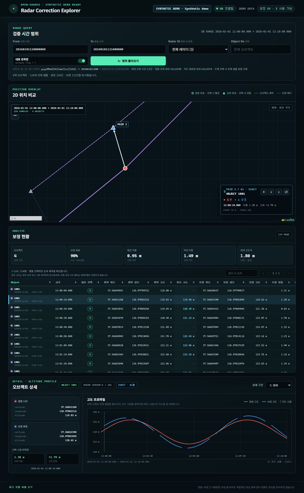

# Radar Correction Explorer

[한국어 문서](README.ko.md)

[](https://github.com/krait4g/radar-correction-explorer/actions/workflows/ci.yml)
[](https://openjdk.org/projects/jdk/21/)
[](LICENSE)

Radar Correction Explorer is a local, read-only web application for comparing raw and corrected radar tracks on a 2D map and an altitude chart. It starts with deterministic synthetic data, so the complete UI can be evaluated without a database, credentials, or private infrastructure.



## Why this project exists

A corrected coordinate is easier to trust when the original sample, corrected sample, displacement, track history, and altitude change can be inspected together. The explorer provides that visual and numerical comparison while remaining independent from the system that produces the data.

Key capabilities:

- Raw samples and corrected samples use different marker shapes.
- Samples from the same object keep the same deterministic color.
- Every raw/corrected pair can be selected, connected, and inspected.
- Altitude series show raw and corrected values on the same time axis.
- Range queries use bounded overview data, while a selected track can be loaded precisely.
- Missing corrected coordinates remain missing; they are never replaced with zero.
- The application does not query tracks until the user requests a range.

## 60-second demo

Requirements:

- JDK 21
- Git

The Maven Wrapper downloads the project-pinned Maven version on first use.

### macOS or Linux

```bash
git clone https://github.com/krait4g/radar-correction-explorer.git
cd radar-correction-explorer
./mvnw spring-boot:run
```

### Windows PowerShell

```powershell
git clone https://github.com/krait4g/radar-correction-explorer.git
Set-Location radar-correction-explorer
.\mvnw.cmd spring-boot:run
```

Open [http://127.0.0.1:28080](http://127.0.0.1:28080), then query:

```text
From  202601011200
To    202601011210
```

The default dataset is generated locally from a fixed seed. The application and API identify it as synthetic demo data.

Stop the foreground process with `Ctrl+C`.

## Build and test

```bash
./mvnw --batch-mode --no-transfer-progress verify
```

On Windows:

```powershell
.\mvnw.cmd --batch-mode --no-transfer-progress verify
```

Run the packaged application:

```bash
java -jar target/radar-correction-explorer.jar
```

The same synthetic demo is the default for the packaged JAR.

### Windows foreground launcher

The repository also includes a foreground launcher that keeps its console open, opens the browser after the health endpoint is ready, and stops with `Ctrl+C`:

```powershell
.\mvnw.cmd --batch-mode --no-transfer-progress package
.\start-viewer.cmd
```

Double-clicking `start-viewer.cmd` provides the same foreground behavior. To create a portable Windows archive under the ignored `dist/` directory, run:

```powershell
.\scripts\package-viewer.ps1
```

## Connecting PostgreSQL

Synthetic mode is intentionally the default. To use a PostgreSQL database:

1. Copy `viewer.config.example.json` to `viewer.config.json`.
2. Configure the JDBC URL, a read-only database user, logical field mappings, and a non-sensitive display label.
3. Keep `viewer.config.json` local. It is excluded by `.gitignore`.
4. Supply the password through `RADAR_DB_PASSWORD` or the launcher's secure prompt; passwords are not accepted in the JSON file.

5. Start the foreground launcher with `.\start-viewer.cmd`.

The launcher uses synthetic mode when `viewer.config.json` is absent and PostgreSQL mode when the file is present. Run `.\launcher\start-viewer.ps1 -Demo` to explicitly ignore a local configuration for one run.

For direct JAR, Maven, container, or CI runs, the same settings can be supplied with environment variables. The Windows launcher validates the JSON file and passes its non-secret settings to the child process through these variables; the password remains runtime-only.

| Variable | Purpose |
|---|---|
| `RADAR_DEMO_ENABLED` | Enables or disables deterministic synthetic mode |
| `RADAR_DB_JDBC_URL` | PostgreSQL JDBC URL |
| `RADAR_DB_USERNAME` | Read-only database user |
| `RADAR_DB_PASSWORD` | Database password for the current process |
| `RADAR_DB_DISPLAY_LABEL` | Non-sensitive label shown in the UI |
| `RADAR_DB_SCHEMA` | Schema identifier |
| `RADAR_DB_TABLE` | Event table identifier |
| `RADAR_DB_COLUMN_*` | Logical-to-physical field mappings |
| `RADAR_VIEWER_HOST` | HTTP bind address; default `127.0.0.1` |
| `RADAR_VIEWER_PORT` | HTTP port; default `28080` |

The example configuration documents every supported mapping. Do not commit a populated local configuration. If PostgreSQL is configured entirely through environment variables, set `RADAR_DEMO_ENABLED=false` and provide every required database and column mapping.

> The application is unauthenticated and designed for loopback use. Do not bind it to a public or shared network interface without adding an authentication and transport-security layer.

## How to read the metrics

The horizontal value is the geodesic displacement between the raw and corrected coordinates. The altitude delta is `corrected altitude - raw altitude`.

These values measure how far a correction moved a sample. They do **not** prove that the corrected sample is more accurate. Accuracy requires an independent ground-truth position and compatible altitude reference systems.

## Architecture

The application uses a small Spring Boot API, a read-only JDBC repository, a dependency-free browser UI, Leaflet for the map, and a canvas altitude chart. The same service contract is used by the in-memory demo and PostgreSQL modes.

See [Architecture](docs/ARCHITECTURE.md) for components, query flow, trust boundaries, and design decisions.

## Performance

Large time ranges are summarized with deterministic, track-aware overview selection rather than truncating the beginning or end of the range. Selecting an object requests its precise samples. The UI further reduces visual density according to the viewport while preserving the selected pair.

No production benchmark is claimed. [Performance](docs/PERFORMANCE.md) defines a reproducible synthetic benchmark protocol and the measurements required for a fair comparison.

## Dependency transparency

- Maven dependencies are declared in `pom.xml`; no application JAR is committed.
- `package` and `verify` generate `target/bom.cdx.json`, a CycloneDX SBOM for runtime dependencies.
- CI verifies Linux and Windows builds and performs a synthetic-mode API smoke test.
- Dependabot checks Maven and GitHub Actions dependencies every week.
- A release maintainer must review the SBOM against upstream license terms and keep [THIRD-PARTY-NOTICES.md](THIRD-PARTY-NOTICES.md) current. An automated SBOM is evidence, not a substitute for that legal review.

## API

The browser uses these read-only endpoints:

| Endpoint | Purpose |
|---|---|
| `GET /api/meta` | Mode, capabilities, time range, limits, and map configuration |
| `GET /api/tracks` | Snapshot or range samples |
| `GET /api/radars` | Available radar identifiers in a range |
| `GET /api/objects/{objectNo}/detail` | Precise samples for one selected track |

Compact time inputs accept `yyyyMMdd`, `yyyyMMddHH`, `yyyyMMddHHmm`, `yyyyMMddHHmmss`, or `yyyyMMddHHmmssSSS`. Missing time components are filled with zero. Equal `from` and `to` values select snapshot behavior; different values select an inclusive range.

## Security and privacy

- Synthetic mode is safe to demonstrate and contains no operational data.
- The server binds to `127.0.0.1` by default and has no authentication layer.
- External database access should use a dedicated role with `SELECT` only.
- JDBC read-only mode is a safety hint, not a replacement for database permissions.
- Secrets must be supplied at runtime and must not be committed, logged, or included in screenshots.
- Map tiles may be requested from the configured provider. Use an approved provider or the coordinate-grid fallback for offline or sensitive environments.

Please read [SECURITY.md](SECURITY.md) before reporting a vulnerability or connecting non-demo data.

## Project documentation

- [Korean README](README.ko.md)
- [Architecture](docs/ARCHITECTURE.md)
- [Performance and benchmark protocol](docs/PERFORMANCE.md)
- [Security policy](SECURITY.md)
- [Third-party notices](THIRD-PARTY-NOTICES.md)

## License

The project is licensed under the [Apache License 2.0](LICENSE).

Map data and third-party libraries retain their own licenses and attribution requirements. OpenStreetMap attribution remains visible when its standard tile service is configured. Release archives should include `LICENSE`, [THIRD-PARTY-NOTICES.md](THIRD-PARTY-NOTICES.md), relevant license texts, and the CycloneDX SBOM.
