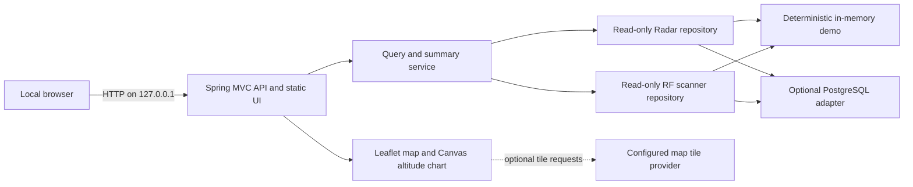
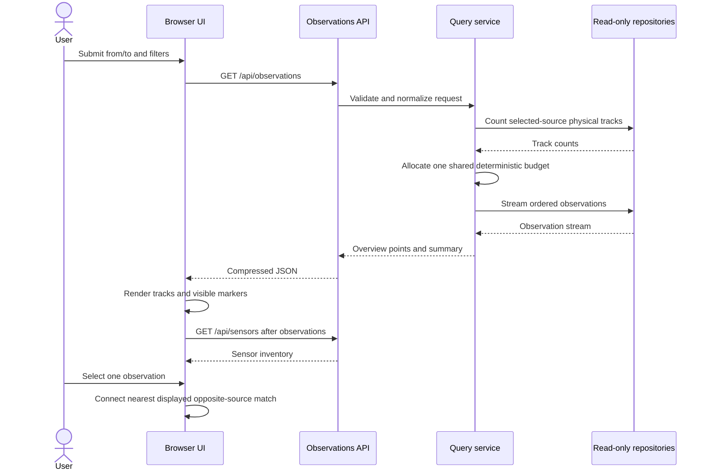

# Architecture

## Context

Radar Correction Explorer is a local validation application. It reads time-ordered Radar observations, optionally reads RF scanner observations, presents their stored positions together, and makes missing data explicit. It does not calculate a corrected position, infer a new cross-source match, or write back to the source database.

The default mode uses deterministic synthetic data. PostgreSQL is an optional adapter selected through an ignored local configuration or environment variables.

## Components

### Browser UI

The browser is a static HTML, CSS, and JavaScript application served by Spring Boot. It is responsible for:

- source, range, sensor, track, object, and match filters;
- Leaflet map presentation;
- Radar raw/corrected pairs, RF scanner markers, and stored cross-source match interaction;
- table paging, filtering, and sorting;
- viewport-aware visual thinning; and
- altitude chart rendering on a canvas.

The UI does not load observations on page startup. It requests metadata first and waits for the user to submit a range. Opening an empty sensor picker may request inventory for that source and the current valid range. A normal range load handles the observation response before refreshing sensor inventory, so those database queries do not start simultaneously. Once a range has been loaded, changing a source toggle immediately reruns the observation query.

### HTTP API

The API validates compact timestamps and filters, returns a stable logical model, and converts expected input failures into structured client errors. It never exposes database credentials or physical column mappings. API responses use `Cache-Control: no-store, max-age=0` so clients do not reuse stale observation or database-status data.

Primary endpoints:

- `/api/meta` for mode, per-source capability, combined and per-source range, limit, and map metadata;
- `/api/observations` for integrated Radar/RFSCNR snapshot or range results;
- `/api/sensors` for per-source sensor inventory in a selected range;
- `/api/tracks` and `/api/radars` for legacy Radar-only clients; and
- `/api/objects/{objectNo}/detail` for one precise physical track.

### Query and summary service

The service owns behavior that is independent of storage:

- snapshot versus inclusive range semantics;
- deterministic allocation of one shared overview-point budget across Radar and RF scanner tracks;
- exact versus sampled summary metadata;
- stored global-object match filtering without a cross-source SQL join;
- horizontal geodesic displacement;
- altitude delta and missing-value semantics; and
- input and operational safety limits.

The horizontal displacement is not an accuracy score. It only describes the movement from the raw coordinate to the corrected coordinate.

### Repository adapters

Both data modes produce the same logical observation models for Radar and optional RF scanner sources.

**Synthetic demo** is the default. It creates a fixed dataset for `2026-01-01 12:00:00` through `12:10:00`, uses no credentials, and is clearly identified in metadata and the UI.

**PostgreSQL** is enabled explicitly. Radar mappings and the optional `database.rfScanner` table and column mappings are configured through `viewer.config.json` or `RADAR_DB_*` variables. Schema, table, and field identifiers are validated as simple SQL identifiers before they can be used in SQL. Filter values are bound as statement parameters. Missing optional RF columns disable only their corresponding capability; a missing or incomplete RF table does not prevent a ready Radar source from being queried.

## Configuration paths

With no external configuration, safe defaults select synthetic demo mode and a loopback HTTP binding. Direct JAR, Maven, container, and CI runs can supply `RADAR_*` environment variables.

The Windows launcher provides a separate local-file path. It validates the ignored `viewer.config.json`, translates its non-secret values into the child process environment, and obtains the database password from `RADAR_DB_PASSWORD` or a secure console prompt. The presence of that file selects PostgreSQL mode; its absence selects the demo. The launcher never reads a password from JSON.

The committed `viewer.config.example.json` contains placeholders only. A populated `viewer.config.json` and every build or distribution directory remain untracked.

## Range query flow

The overview is not a prefix or suffix truncation. Each selected source and physical track receives a deterministic share of one configured display budget, preserving endpoints and distributing remaining points through time. Counts and correction/RF statistics describe the full query range, while the displayed-object count describes only objects represented by returned points. Exact data for a selected Radar or RF scanner physical track can replace its overview representation.

## Snapshot semantics

When normalized `from` and `to` values are equal, the service first reads candidates inside the `±toleranceMs` window. It then selects the closest Radar row per `(objectNo, radarId, radarObjectNo)` track and the closest RF scanner row per `(rfScannerId, trackId)` track. Deterministic ordering resolves equal-distance ties. Candidate counts and full-window metrics remain distinct from the nearest points returned for display.

When the values differ, both endpoints are included in the range.

## Missing data

The logical observation model separates:

- raw longitude, latitude, and altitude;
- corrected longitude, latitude, and altitude;
- track and sensor identity;
- timestamp and optional sequence identity; and
- optional classification or reference values.

RF scanner altitude has an explicit reference: `position.altitude` is relative to the source's home position, while `home.altitude` is mean-sea-level altitude. The explorer displays both independently and never adds them to manufacture a derived altitude.

Missing corrected values stay `null`. The map can still show a valid raw point; the corresponding corrected marker, vector, or metric is omitted. A missing altitude creates a gap rather than a zero-height sample.

## Performance boundaries

Three layers control large ranges:

1. Database statements use timeouts, forward-only streaming where available, and a small read-only pool.
2. The service bounds the combined Radar/RF scanner overview output while computing the documented full-range summaries over the source streams.
3. The browser reduces non-selected visual density by viewport and zoom while preserving the selected pair and track.

See [Performance](PERFORMANCE.md) for the reproducible measurement protocol.

## Security boundaries

The default trust boundary is one local user and one loopback process. The application has no built-in authentication or authorization layer.

- A non-loopback bind is a deployment architecture change, not a normal configuration tweak.
- Database authorization must enforce `SELECT`-only access.
- JDBC read-only mode is defense in depth, not the primary permission boundary.
- The map tile provider receives tile coordinates and the user's network metadata when external tiles are enabled.
- Synthetic mode prevents a clone, CI job, or screenshot from requiring private data.

See [Security Policy](../SECURITY.md) for reporting and deployment guidance.

## Non-goals

- Producing or modifying corrected coordinates.
- Inferring or persisting cross-source object matches.
- Proving accuracy without independent ground truth.
- Editing database records.
- Multi-user hosting, remote access, or role-based authorization.
- Replacing a time-series store or a geospatial analysis platform.

## Extension points

Storage-specific field mappings belong in configuration and repository adapters. New map layers or chart series should consume the logical API model instead of physical database identifiers. A future remote deployment should add a separate gateway or security module rather than weakening the loopback default.
